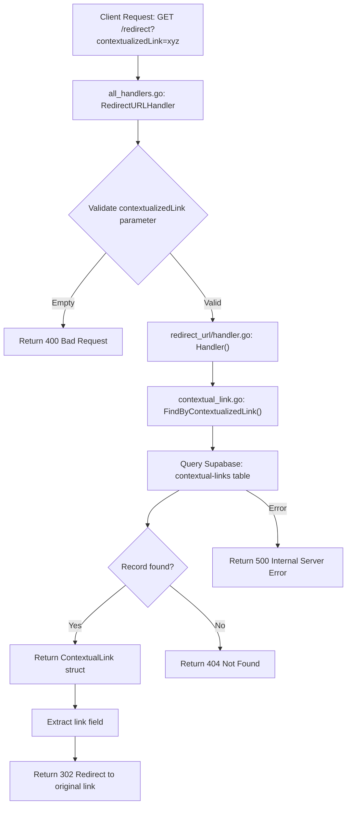

# Feature 0001: Redirect URL

## Description
Create a redirect endpoint that receives a contextualized link, looks up the original link in the Supabase `contextual-links` table, and redirects the user to the original link.

## Files to Create

### 1. Handler Component
**File**: `be/internal/components/redirect_url/handler.go`
- Create `RedirectURLHandler` struct with `ContextualLinkRepository` dependency
- Implement `Handler(contextualizedLink string) (string, error)` method that:
  - Validates contextualizedLink parameter is not empty
  - Calls repository to find record by contextualized_link
  - Returns the original link if found
  - Returns error if not found or on database errors

## Files to Modify

### 1. Repository Layer
**File**: `be/internal/repositories/contextual_link.go`
- Add new method: `FindByContextualizedLink(contextualizedLink string) (*ContextualLink, error)`
  - Query `contextual-links` table with filter on `contextualized_link` column
  - Return ContextualLink struct if found
  - Return nil if no match found
  - Return error on query failures

### 2. Main Entry Point
**File**: `be/cmd/main.go`
- Import the new `redirect_url` component package
- Initialize `RedirectURLHandler` with the existing `contextualLinkRepository`
- Register new GET endpoint `/redirect` with handler

### 3. HTTP Handler
**File**: `be/cmd/all_handlers.go`
- Add `RedirectURLHandler` function that:
  - Extracts `contextualizedLink` query parameter
  - Calls handler to get original link
  - Issues HTTP 302 redirect to the original link
  - Returns 400 if contextualizedLink is missing
  - Returns 404 if contextualized link not found in database
  - Returns 500 on other errors
- Add Swagger documentation comments for the endpoint

## Algorithm

### Request Flow
1. Client makes GET request to `/redirect?contextualizedLink={encoded_link}`
2. HTTP handler extracts `contextualizedLink` query parameter
3. Handler validates the parameter is not empty
4. Repository queries database: `SELECT * FROM "contextual-links" WHERE contextualized_link = ?`
5. If record found:
   - Extract `link` field from record
   - Return HTTP 302 redirect with Location header set to original link
6. If not found:
   - Return HTTP 404 with error message
7. If database error:
   - Return HTTP 500 with error message

## Mermaid Flow Diagram

## Database Schema
Existing table `contextual-links` will be used:
- `id` (string): Primary key
- `link` (string): Original URL
- `contextualized_link` (string): AI-generated contextualized version
- `created_at` (timestamp)
- `updated_at` (timestamp)

Query will filter on `contextualized_link` column to retrieve the corresponding `link`.

## Dependencies
- Existing `repositories.ContextualLinkRepository`
- Existing Supabase client configuration
- Gin router framework for HTTP handling

