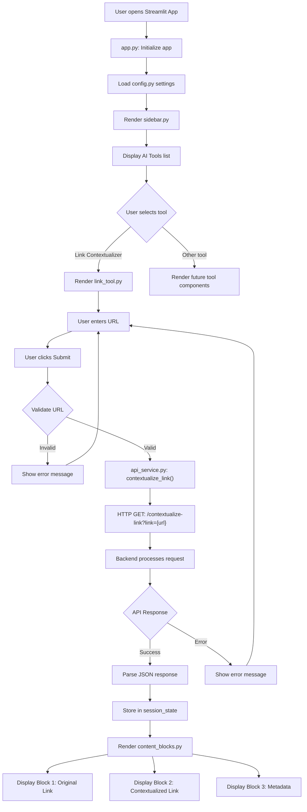
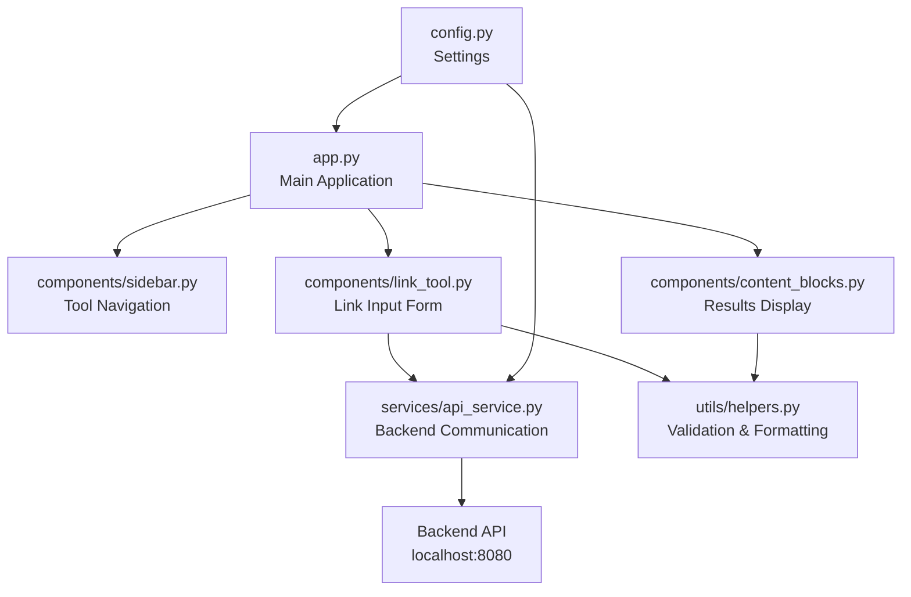

# Feature 0001: Main UI Layout with Sidebar and Link Tool

## Description
Build a Streamlit-based UI with a left sidebar (30% width) displaying a list of AI tools, and a main content area (70% width) containing a link contextualization tool at the top and content blocks below to display data results.

## Files to Create

### 1. Main Application Entry Point
**File**: `ui/app.py`
- Create the main Streamlit app entry point
- Configure page layout with wide mode
- Set up session state management for tool selection and data
- Initialize the application structure

### 2. Sidebar Component
**File**: `ui/components/sidebar.py`
- Create `render_sidebar()` function that:
  - Renders sidebar with 30% width allocation using `st.sidebar`
  - Displays title "AI Tools"
  - Shows list of available tools as radio buttons or selectbox:
    - "Link Contextualizer" (default)
    - Additional tools (placeholders for future expansion)
  - Returns selected tool name
  - Stores selected tool in session state

### 3. Link Contextualization Tool Component
**File**: `ui/components/link_tool.py`
- Create `render_link_tool()` function that:
  - Renders a form with:
    - Text input field for original link URL
    - Submit button "Contextualize Link"
  - Validates URL format
  - Calls backend API `/contextualize-link?link={url}` when submitted
  - Displays loading spinner during API call
  - Shows result in a success message box with:
    - Original link
    - Contextualized link (clickable)
  - Stores results in session state
  - Returns API response data

### 4. Content Display Component
**File**: `ui/components/content_blocks.py`
- Create `render_content_blocks(data)` function that:
  - Takes data from link tool results
  - Renders multiple content blocks using `st.container()`:
    - **Block 1**: Original Link Display
      - Shows the input URL in a card-style container
    - **Block 2**: Contextualized Link Display
      - Shows the generated contextualized link
      - Includes copy-to-clipboard functionality
    - **Block 3**: Link Metadata (if available)
      - Timestamp of creation
      - Any additional metadata from API
  - Uses Streamlit columns for responsive layout
  - Applies styling with custom CSS

### 5. API Service Layer
**File**: `ui/services/api_service.py`
- Create `APIService` class with methods:
  - `__init__(base_url)`: Initialize with backend API base URL
  - `contextualize_link(link: str) -> dict`: 
    - Makes GET request to `/contextualize-link?link={link}`
    - Handles errors and timeouts
    - Returns parsed JSON response
  - `redirect_link(client: str, contextualized_link: str) -> str`:
    - Constructs redirect URL for future use
    - Returns full redirect URL
  - Error handling for network failures

### 6. Configuration File
**File**: `ui/config.py`
- Define configuration constants:
  - `BACKEND_API_URL`: Backend API base URL (default: "http://localhost:8080")
  - `SIDEBAR_WIDTH_PERCENT`: 30
  - `MAIN_CONTENT_WIDTH_PERCENT`: 70
  - `AVAILABLE_TOOLS`: List of tool names
  - API timeout settings

### 7. Utility Functions
**File**: `ui/utils/helpers.py`
- Create helper functions:
  - `validate_url(url: str) -> bool`: Validate URL format
  - `format_timestamp(timestamp: str) -> str`: Format timestamps
  - `copy_to_clipboard_button(text: str)`: Create copy button for text

## Files to Modify

### 1. Requirements File
**File**: `ui/requirements.txt`
- Add dependencies:
  - `streamlit>=1.28.0`
  - `requests>=2.31.0`
  - `validators>=0.22.0`

## Algorithm

### Application Flow
1. User launches Streamlit app (`streamlit run app.py`)
2. App initializes with default state:
   - Selected tool: "Link Contextualizer"
   - Data: Empty/None
3. Sidebar renders with tool list
4. Main content area renders based on selected tool
5. For Link Contextualizer tool:
   - User enters URL in input field
   - User clicks "Contextualize Link" button
   - Validate URL format
   - Show loading spinner
   - Call backend API: `GET /contextualize-link?link={encoded_url}`
   - Parse API response
   - Store result in session state
   - Render content blocks with data
6. Content blocks display:
   - Original link in Block 1
   - Contextualized link in Block 2
   - Metadata in Block 3

### API Communication Flow
1. User input URL → Frontend validation
2. Valid URL → API service layer
3. API service → HTTP GET request to backend
4. Backend processes → Returns JSON response
5. Frontend receives response → Parse and validate
6. Update session state → Trigger UI re-render
7. Display results in content blocks

## Layout Structure

### Streamlit Layout Approach
- Use `st.set_page_config(layout="wide")` for full-width layout
- Use `st.sidebar` for left sidebar (Streamlit handles 30% width automatically)
- Use `st.columns()` for responsive content blocks in main area
- Use `st.container()` for grouping related content blocks
- Apply custom CSS via `st.markdown()` for additional styling

### Responsive Design
- Main area uses columns: `col1, col2 = st.columns([7, 3])`
- Content blocks stack vertically on smaller screens
- Sidebar remains fixed on left

## Mermaid Flow Diagram

## Component Architecture

## Session State Management
- `st.session_state.selected_tool`: Currently selected tool name (string)
- `st.session_state.link_data`: Results from link contextualization API (dict)
- `st.session_state.error_message`: Error messages to display (string)
- `st.session_state.loading`: Loading state boolean

## Dependencies
- Streamlit framework for UI
- requests library for HTTP API calls
- validators library for URL validation
- Backend API must be running on `http://localhost:8080`

## Error Handling
- URL validation before API call
- Network error handling with user-friendly messages
- API error responses displayed in error containers
- Fallback UI when data is not available
- Timeout handling for slow API responses

## Future Extensibility
- Sidebar designed to accommodate additional tools
- Session state structure supports multiple tool data
- API service layer can be extended with new endpoints
- Content blocks component can be reused for different data types

